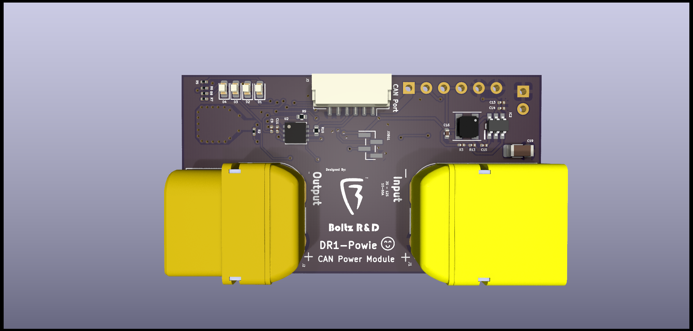
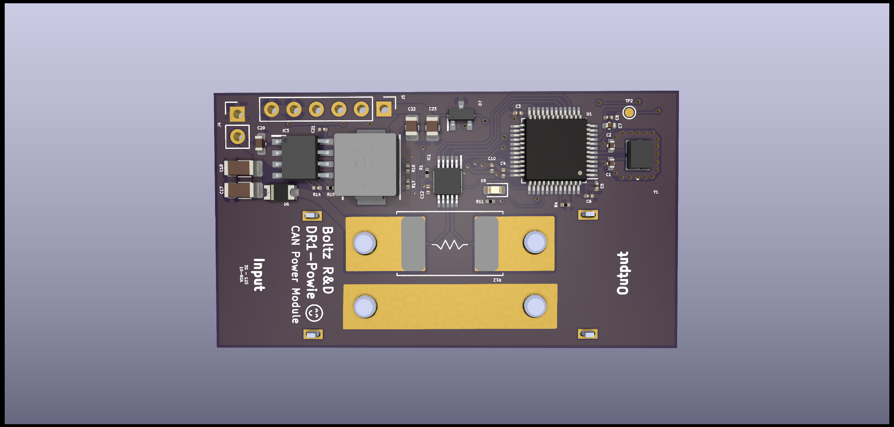

# DR1-Powie ☺  
UAVCAN-Based Power Module for DR1 Series Flight Controllers

# Specifications:

Voltage: 3S - 12S  
Current Rating: 10A - 90A  
Embedded 5V 2A Buck to power the Flight Controller  
Battery Gauge LEDs (Will be functional in the near future)  

# License
This project is licensed under the Attribution-ShareAlike 4.0 International License.

You are free to commercially utilize the project and its derivatives. Please be generous and provide attribution! :)

THANKS!

Note: The Boltz R&D wordmark and lightning logo are trademarks of Boltz R&D. Any use other than for attribution of "this" project is strictly prohibited.